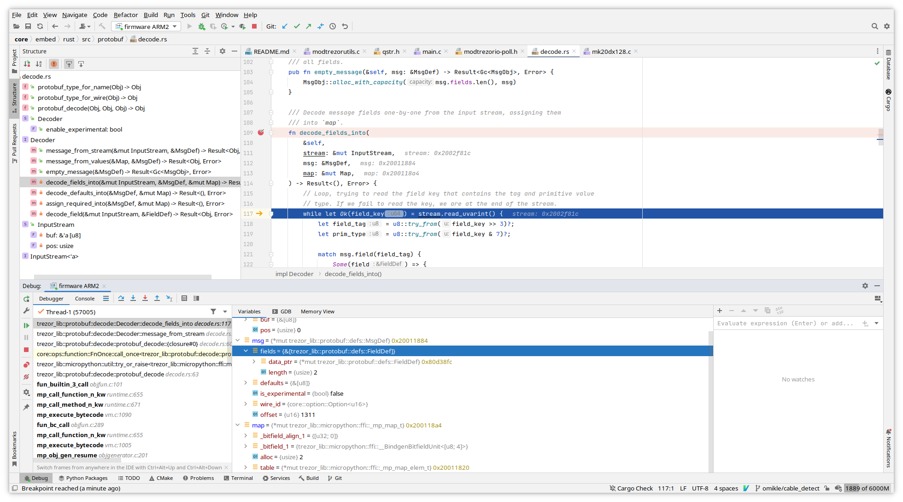

# Embedded debug of firmware (C and Rust)

Notes on how to get both C and Rust debugging working "nicely".

## Building properly

The #1 hassle in embedded debug is proper build because it is very easy to run out of flash space.
Size optimizations on the other hand go against comfort or usability of debug.

Therefore it's usually hard to make a single profile or setting, but best way is to start with
is probably these build options:

    make PYOPT=0 BITCOIN_ONLY=1 V=1 VERBOSE=1 OPTIMIZE=-Og build_firmware

Options mean:

 * `PYOPT=0` - enable debuglink and test
 * `V=1 VERBOSE=1` - just more of a check to see it's building with options you want
 * `BITCOIN_ONLY=1` - most of the time for C/Rust parts you don't need other coins and it saves
   space on flash to be usable for other than `-Os` optimization
 * `OPTIMIZE=-Og` - optimization of C better suited for debug, but it will be larger than default `-Os`

Micropython has its own optimization setting, so if you need to step through its code as well,
set it separately in its build.

Another way to save space in case build overflows flash is changing `-fstack-protector-all` to
`-fstack-protector-strong` or `-fstack-protector-explicit` temporarily for debugging in
`SConscript.firmware`.

Debug info is enabled for C and Rust in the flags and profiles (stripped when generating the .bin
final image).

## Putting it into debugger

Once you have built and flashed the FW, configure debugger for remote debug. 
General background into remote debug and instructions
for basic `arm-none-eabi-gdb` and VSCode are [listed here](https://docs.rust-embedded.org/debugonomicon/).

Below are instructions for CLion with [Rust plugin](https://plugins.jetbrains.com/plugin/8182-rust/docs).

So far CLion seems the most complete implementation for ARM embedded debug, but
these evolve quickly now.

Though all debuggers will have some historic limitations (especially some watch expressions
and return values).

### Start OpenOCD/JLink GDB server in a terminal

Depending on your SWD adapter, either (change speed up to 50000 depending on adapter)

    JLinkGDBServerCLExe -select USB -device STM32F427VI -endian little -if SWD -speed 4000 -LocalhostOnly

or with openocd (best to use latest from git)

    openocd -f interface/stlink.cfg -f target/stm32f4x.cfg

### Set up a debug configuration as remote debug

Default port for "target remote" JLink GDB server is :2331, for openocd :3333

It should be also possible to use "Remote GDB Server" setting and let CLion execute
openocd or JLink GDB server.

### Now you can see variables from both Rust and C, set breakpoints

For pointers you can use memory view from variable's context menu.

### Known limitations

Rust support is still in progress, so expect bugs sometimes.

Only way so far to get return value of function is to switch to GDB console and
use `finish` GDB command - unless you assign it to variable. GDB may not always show
it due to optimizations.

Not all trait info is output into debug info, so you will have issue with watching
some expressions like [this issue](https://github.com/rust-lang/rust/issues/66482) or 
[this one](https://github.com/rust-lang/rust/issues/33014).

Try not to put breakpoints on macro calls, since they may internally expand to
too many addresses depending on inlining. This manifests when GDB will complain
suddenly you have too many HW breakpoints or when JLink starts using flash
breakpoints instead of just HW breakpoints.

## Other ideas not thoroughly tested

You can define custom optimization level by choosing the `-fxx` options for C compiler and
similar ones for Rust with `llvm-args` [that target LLVM passes](https://llvm.org/docs/Passes.html).
Note that these change with compiler versions, LLVM 13 has 
[new pass manager](https://llvm.org/docs/NewPassManager.html#invoking-opt).

The point would be to make a optimization level producing somewhat slower code, less inlining,
but better debug experience.

Rust does not have equivalent of `-Og` level, this would be only way to make something similar.

The idea is generally to take an existing optimization level and change/remove some options
that affect code size or optimize variables away, force them to stay in memory instead of
registers. To look at what is used in passes you can print them out with:

    llvm-as < /dev/null | opt -Oz -disable-output -debug-pass=Arguments

The `-O0` level often generates too big code to fit in flash which is why this experiment
in customizing optimization level exists.
